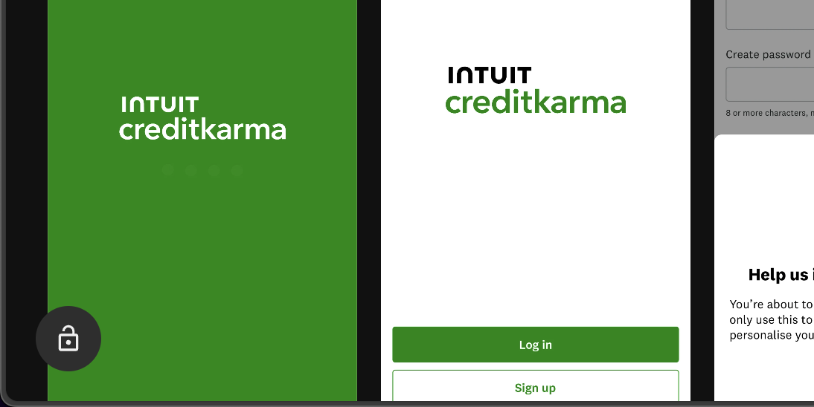

  

<h1 align="center">Mobbin Unlocked</h1>

Chrome extension that unlocks pro features on mobbin.com

## ⚡️ Introduction

> [!WARNING]
> This extension is for educational purposes only. I am not responsible for any misuse, violations of terms of service, or any consequences resulting from its use. Use at your own risk.

## Author

- [@iamsahebgiri](https://github.com/iamsahebgiri)

## ⭐️ Contribute

If you want to say thank you and/or support the active development of example:

1. Add a GitHub Star to the project.
2. Tweet about the project on your Twitter.
3. Write a review or tutorial on Medium, Dev.to or personal blog.
4. Support the project by donating a cup of coffee.

